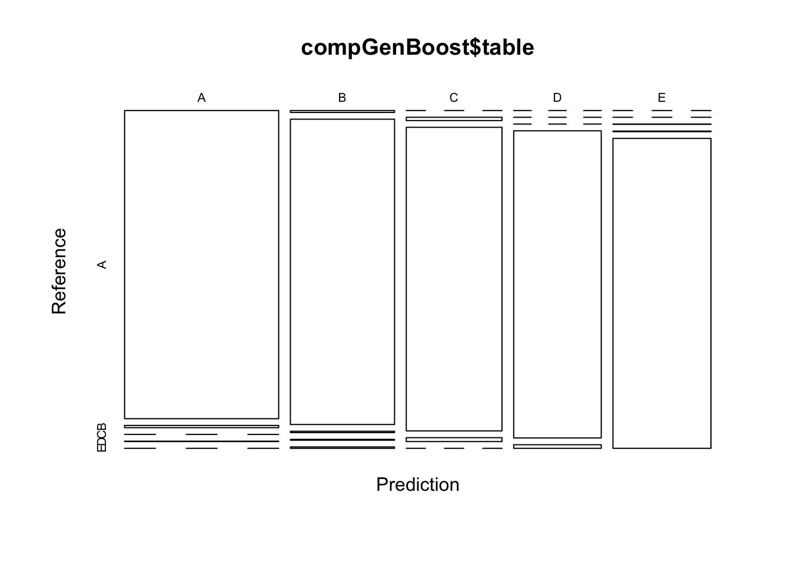

<hr>
#### Overview:
Using devices such as Jawbone Up, Nike FuelBand, and Fitbit it is now possible to collect a large amount of data about personal activity relatively inexpensively. These type of devices are part of the quantified self movement – a group of enthusiasts who take measurements about themselves regularly to improve their health, to find patterns in their behavior, or because they are tech geeks. One thing that people regularly do is quantify how much of a particular activity they do, but they rarely quantify how well they do it. In this project, your goal will be to use data from accelerometers on the belt, forearm, arm, and dumbell of 6 participants. They were asked to perform barbell lifts correctly and incorrectly in 5 different ways. 

#### Links For The Raw Data:

<p>
The data for this project are available here:
<ul>
  <li>
  Link to download traning data: [Training Data CSV]("https://d396qusza40orc.cloudfront.net/predmachlearn/pml-training.csv")
  </li>
  <li>
  Link to download test data: [Test Data CSV]("https://d396qusza40orc.cloudfront.net/predmachlearn/pml-testing.csv") 
  </li> 
  <li>
   Link to main source: [Main Source ]("http://groupware.les.inf.puc-rio.br/har") 
  </li>
</ul>
</p>


```r
# To reproduce the result please change the working directory
workingDirectory = "/Projects/Rworkspace/coursera/courseraMLWeek4"
setwd(workingDirectory)
```
#### Loading data & performing some basic exploratory data analysis:

```r
# Packages
library(caret)
```


```r
# checking if data directory exists if not creating it
if(!file.exists("./data")){
  dir.create("data")
  
  # Downloading the file 
  trainDataUrlPath <- "https://d396qusza40orc.cloudfront.net/predmachlearn/pml-training.csv"
  download.file(trainDataUrlPath, "./data/trainData.csv", method="curl")
  
  # Downloading the file 
  testDataUrlPath <- "https://d396qusza40orc.cloudfront.net/predmachlearn/pml-testing.csv"
  download.file(testDataUrlPath, "./data/testData.csv", method="curl")
}
```

Taking the overview of the training data before processing.
</i></p>

```r
# Loading the dataset
trainDataset <- read.csv("./data/trainData.csv", header = TRUE, sep = ",", quote = "\"", na.strings=c("NA","#DIV/0!",""))
validationDataset <- read.csv("./data/testData.csv", header = TRUE, sep = ",", quote = "\"", na.strings=c("NA","#DIV/0!",""))

# Cleaning the data
# removing near zero values
nearZeroVar <- nearZeroVar(trainDataset)
trainDataset <- trainDataset[, -nearZeroVar]

# removing na's 
nalVal <- sapply(trainDataset, function(x) mean(is.na(x))) > 0.95
trainDataset <- trainDataset[, nalVal==FALSE]

# removing the column 1:5
trainDataset <- trainDataset[, -c(1:5)]

# Partitioning the data
inTrain  <- createDataPartition(trainDataset$classe, p=0.7, list=FALSE)
trainingDataset <- trainDataset[inTrain,]
testingDataset <- trainDataset[-inTrain,]

# Checking the dimmension of the training data
dim(trainingDataset)
```

```
## [1] 13737    54
```

```r
# Checking the dimmension of the validation data
dim(testingDataset)
```

```
## [1] 5885   54
```
#### Model Building
####Using Decision Tree - Classification Model:

```r
# setting seed
set.seed(987)

# Fitting model using caret package - (method = rpart, i.e: decision tree)
modelFitDecionTree <- train(classe ~ ., data=trainingDataset, method="rpart")
modelFitDecionTree
```

```
## CART 
## 
## 13737 samples
##    53 predictor
##     5 classes: 'A', 'B', 'C', 'D', 'E' 
## 
## No pre-processing
## Resampling: Bootstrapped (25 reps) 
## Summary of sample sizes: 13737, 13737, 13737, 13737, 13737, 13737, ... 
## Resampling results across tuning parameters:
## 
##   cp          Accuracy   Kappa     
##   0.03880582  0.5546425  0.42955823
##   0.05538602  0.4099944  0.19504182
##   0.11351846  0.3214589  0.05315859
## 
## Accuracy was used to select the optimal model using the largest value.
## The final value used for the model was cp = 0.03880582.
```

```r
# Predicting on the test set
modelPredictDecionTree <- predict(modelFitDecionTree, newdata=testingDataset)
compDecisionTree <- confusionMatrix(modelPredictDecionTree, testingDataset$classe)
compDecisionTree
```

```
## Confusion Matrix and Statistics
## 
##           Reference
## Prediction    A    B    C    D    E
##          A 1526  482  491  408  112
##          B   26  387   26  168   78
##          C  116  270  509  349  220
##          D    0    0    0    0    0
##          E    6    0    0   39  672
## 
## Overall Statistics
##                                           
##                Accuracy : 0.5257          
##                  95% CI : (0.5129, 0.5386)
##     No Information Rate : 0.2845          
##     P-Value [Acc > NIR] : < 2.2e-16       
##                                           
##                   Kappa : 0.3807          
##  Mcnemar's Test P-Value : < 2.2e-16       
## 
## Statistics by Class:
## 
##                      Class: A Class: B Class: C Class: D Class: E
## Sensitivity            0.9116  0.33977  0.49610   0.0000   0.6211
## Specificity            0.6455  0.93721  0.80346   1.0000   0.9906
## Pos Pred Value         0.5055  0.56496  0.34768      NaN   0.9372
## Neg Pred Value         0.9484  0.85538  0.88306   0.8362   0.9207
## Prevalence             0.2845  0.19354  0.17434   0.1638   0.1839
## Detection Rate         0.2593  0.06576  0.08649   0.0000   0.1142
## Detection Prevalence   0.5130  0.11640  0.24877   0.0000   0.1218
## Balanced Accuracy      0.7785  0.63849  0.64978   0.5000   0.8059
```
<i>The following are the results obtained by Decision Tree model</i>
<ul>
  <li>Decision Tree Accuracy: 0.5257434 </li>
  <li>The out-of-sample error: 0.4742566</li>
</ul>


```r
# graphical overview
plot(compDecisionTree$table, col = compDecisionTree$byClass)
```

<!-- -->

<hr>
#### Using Random Forest:

```r
# setting seed
set.seed(657)

# defining cross validation parameter for the model
crossValidationParamRF <- trainControl(
    method="cv",
    number=5,
    savePredictions = TRUE,
    classProbs = TRUE,
    verboseIter=FALSE
    )

# Fitting model using caret package - (method = rf, i.e: random forest)
modelFitRandomForest <- train(classe ~ ., data=trainingDataset, method="rf",
                          trControl=crossValidationParamRF)
modelFitRandomForest
```

```
## Random Forest 
## 
## 13737 samples
##    53 predictor
##     5 classes: 'A', 'B', 'C', 'D', 'E' 
## 
## No pre-processing
## Resampling: Cross-Validated (5 fold) 
## Summary of sample sizes: 10990, 10990, 10990, 10988, 10990 
## Resampling results across tuning parameters:
## 
##   mtry  Accuracy   Kappa    
##    2    0.9938852  0.9922644
##   27    0.9965055  0.9955798
##   53    0.9936665  0.9919882
## 
## Accuracy was used to select the optimal model using the largest value.
## The final value used for the model was mtry = 27.
```

```r
# Predicting on the test set
modelPredictRandomForest <- predict(modelFitRandomForest, newdata=testingDataset)

compRandomForest <- confusionMatrix(modelPredictRandomForest, testingDataset$classe)
compRandomForest
```

```
## Confusion Matrix and Statistics
## 
##           Reference
## Prediction    A    B    C    D    E
##          A 1673    1    0    0    0
##          B    0 1137    3    0    0
##          C    0    1 1023    6    0
##          D    0    0    0  958    1
##          E    1    0    0    0 1081
## 
## Overall Statistics
##                                           
##                Accuracy : 0.9978          
##                  95% CI : (0.9962, 0.9988)
##     No Information Rate : 0.2845          
##     P-Value [Acc > NIR] : < 2.2e-16       
##                                           
##                   Kappa : 0.9972          
##  Mcnemar's Test P-Value : NA              
## 
## Statistics by Class:
## 
##                      Class: A Class: B Class: C Class: D Class: E
## Sensitivity            0.9994   0.9982   0.9971   0.9938   0.9991
## Specificity            0.9998   0.9994   0.9986   0.9998   0.9998
## Pos Pred Value         0.9994   0.9974   0.9932   0.9990   0.9991
## Neg Pred Value         0.9998   0.9996   0.9994   0.9988   0.9998
## Prevalence             0.2845   0.1935   0.1743   0.1638   0.1839
## Detection Rate         0.2843   0.1932   0.1738   0.1628   0.1837
## Detection Prevalence   0.2845   0.1937   0.1750   0.1630   0.1839
## Balanced Accuracy      0.9996   0.9988   0.9978   0.9968   0.9994
```
<i>The following are the results obtained by Random Forest</i>
<ul>
  <li>Random Forest Accuracy: 0.997791 </li>
  <li>The out-of-sample error: 0.002209</li>
</ul>


```r
# graphical overview
plot(compRandomForest$table, col = compRandomForest$byClass)
```

<!-- -->

<hr>
#### Using Generalized Boosted Model:

```r
# setting seed
set.seed(345)

# defining cross validation parameter for the Generalized Boosted Regression Model
crossValidationParamGB <- trainControl(
    method="repeatedcv",
    number=5,
    repeats = 1,
    savePredictions = TRUE,
    classProbs = TRUE
    )
# Fitting model using caret package - (method = gbm, i.e: generalized boosted regression)
modelFitGenBoost <- train(classe ~ ., data=trainingDataset, method="gbm",
                          trControl=crossValidationParamGB)
```

```
## Iter   TrainDeviance   ValidDeviance   StepSize   Improve
##      1        1.6094             nan     0.1000    0.1282
##      2        1.5243             nan     0.1000    0.0833
##      3        1.4670             nan     0.1000    0.0667
##      4        1.4233             nan     0.1000    0.0542
##      5        1.3880             nan     0.1000    0.0490
##      6        1.3559             nan     0.1000    0.0447
##      7        1.3272             nan     0.1000    0.0357
##      8        1.3042             nan     0.1000    0.0401
##      9        1.2779             nan     0.1000    0.0319
##     10        1.2556             nan     0.1000    0.0281
##     20        1.0965             nan     0.1000    0.0212
##     40        0.9130             nan     0.1000    0.0092
##     60        0.7993             nan     0.1000    0.0063
##     80        0.7162             nan     0.1000    0.0048
##    100        0.6509             nan     0.1000    0.0036
##    120        0.5975             nan     0.1000    0.0044
##    140        0.5503             nan     0.1000    0.0024
##    150        0.5287             nan     0.1000    0.0024
## 
## Iter   TrainDeviance   ValidDeviance   StepSize   Improve
##      1        1.6094             nan     0.1000    0.1891
##      2        1.4866             nan     0.1000    0.1319
##      3        1.4019             nan     0.1000    0.1040
##      4        1.3346             nan     0.1000    0.0895
##      5        1.2776             nan     0.1000    0.0727
##      6        1.2307             nan     0.1000    0.0680
##      7        1.1870             nan     0.1000    0.0627
##      8        1.1479             nan     0.1000    0.0543
##      9        1.1130             nan     0.1000    0.0538
##     10        1.0788             nan     0.1000    0.0423
##     20        0.8606             nan     0.1000    0.0238
##     40        0.6314             nan     0.1000    0.0086
##     60        0.5014             nan     0.1000    0.0077
##     80        0.4046             nan     0.1000    0.0065
##    100        0.3330             nan     0.1000    0.0030
##    120        0.2753             nan     0.1000    0.0027
##    140        0.2339             nan     0.1000    0.0027
##    150        0.2152             nan     0.1000    0.0023
## 
## Iter   TrainDeviance   ValidDeviance   StepSize   Improve
##      1        1.6094             nan     0.1000    0.2419
##      2        1.4552             nan     0.1000    0.1593
##      3        1.3512             nan     0.1000    0.1198
##      4        1.2759             nan     0.1000    0.1048
##      5        1.2092             nan     0.1000    0.1033
##      6        1.1461             nan     0.1000    0.0712
##      7        1.1000             nan     0.1000    0.0856
##      8        1.0466             nan     0.1000    0.0644
##      9        1.0067             nan     0.1000    0.0597
##     10        0.9693             nan     0.1000    0.0620
##     20        0.6970             nan     0.1000    0.0310
##     40        0.4497             nan     0.1000    0.0120
##     60        0.3317             nan     0.1000    0.0054
##     80        0.2507             nan     0.1000    0.0034
##    100        0.1990             nan     0.1000    0.0032
##    120        0.1570             nan     0.1000    0.0018
##    140        0.1273             nan     0.1000    0.0009
##    150        0.1160             nan     0.1000    0.0021
## 
## Iter   TrainDeviance   ValidDeviance   StepSize   Improve
##      1        1.6094             nan     0.1000    0.1293
##      2        1.5254             nan     0.1000    0.0860
##      3        1.4686             nan     0.1000    0.0659
##      4        1.4250             nan     0.1000    0.0499
##      5        1.3916             nan     0.1000    0.0482
##      6        1.3592             nan     0.1000    0.0398
##      7        1.3333             nan     0.1000    0.0404
##      8        1.3073             nan     0.1000    0.0407
##      9        1.2799             nan     0.1000    0.0347
##     10        1.2580             nan     0.1000    0.0289
##     20        1.0938             nan     0.1000    0.0172
##     40        0.9124             nan     0.1000    0.0090
##     60        0.7999             nan     0.1000    0.0058
##     80        0.7176             nan     0.1000    0.0050
##    100        0.6543             nan     0.1000    0.0044
##    120        0.5977             nan     0.1000    0.0039
##    140        0.5495             nan     0.1000    0.0026
##    150        0.5284             nan     0.1000    0.0022
## 
## Iter   TrainDeviance   ValidDeviance   StepSize   Improve
##      1        1.6094             nan     0.1000    0.1952
##      2        1.4856             nan     0.1000    0.1343
##      3        1.4008             nan     0.1000    0.0984
##      4        1.3357             nan     0.1000    0.0917
##      5        1.2780             nan     0.1000    0.0727
##      6        1.2312             nan     0.1000    0.0726
##      7        1.1851             nan     0.1000    0.0645
##      8        1.1451             nan     0.1000    0.0557
##      9        1.1105             nan     0.1000    0.0560
##     10        1.0752             nan     0.1000    0.0406
##     20        0.8491             nan     0.1000    0.0303
##     40        0.6115             nan     0.1000    0.0116
##     60        0.4834             nan     0.1000    0.0086
##     80        0.3948             nan     0.1000    0.0055
##    100        0.3257             nan     0.1000    0.0061
##    120        0.2732             nan     0.1000    0.0032
##    140        0.2285             nan     0.1000    0.0011
##    150        0.2114             nan     0.1000    0.0027
## 
## Iter   TrainDeviance   ValidDeviance   StepSize   Improve
##      1        1.6094             nan     0.1000    0.2357
##      2        1.4571             nan     0.1000    0.1608
##      3        1.3563             nan     0.1000    0.1257
##      4        1.2759             nan     0.1000    0.1108
##      5        1.2073             nan     0.1000    0.1044
##      6        1.1415             nan     0.1000    0.0778
##      7        1.0932             nan     0.1000    0.0608
##      8        1.0535             nan     0.1000    0.0676
##      9        1.0097             nan     0.1000    0.0709
##     10        0.9675             nan     0.1000    0.0593
##     20        0.6963             nan     0.1000    0.0257
##     40        0.4514             nan     0.1000    0.0168
##     60        0.3267             nan     0.1000    0.0068
##     80        0.2460             nan     0.1000    0.0036
##    100        0.1950             nan     0.1000    0.0057
##    120        0.1544             nan     0.1000    0.0027
##    140        0.1233             nan     0.1000    0.0019
##    150        0.1120             nan     0.1000    0.0021
## 
## Iter   TrainDeviance   ValidDeviance   StepSize   Improve
##      1        1.6094             nan     0.1000    0.1290
##      2        1.5238             nan     0.1000    0.0854
##      3        1.4674             nan     0.1000    0.0667
##      4        1.4235             nan     0.1000    0.0527
##      5        1.3895             nan     0.1000    0.0483
##      6        1.3574             nan     0.1000    0.0408
##      7        1.3308             nan     0.1000    0.0393
##      8        1.3059             nan     0.1000    0.0393
##      9        1.2795             nan     0.1000    0.0328
##     10        1.2579             nan     0.1000    0.0312
##     20        1.0970             nan     0.1000    0.0176
##     40        0.9112             nan     0.1000    0.0114
##     60        0.8014             nan     0.1000    0.0055
##     80        0.7210             nan     0.1000    0.0055
##    100        0.6556             nan     0.1000    0.0035
##    120        0.5998             nan     0.1000    0.0030
##    140        0.5533             nan     0.1000    0.0027
##    150        0.5327             nan     0.1000    0.0026
## 
## Iter   TrainDeviance   ValidDeviance   StepSize   Improve
##      1        1.6094             nan     0.1000    0.1860
##      2        1.4863             nan     0.1000    0.1261
##      3        1.4043             nan     0.1000    0.1095
##      4        1.3337             nan     0.1000    0.0853
##      5        1.2788             nan     0.1000    0.0829
##      6        1.2270             nan     0.1000    0.0696
##      7        1.1827             nan     0.1000    0.0604
##      8        1.1450             nan     0.1000    0.0504
##      9        1.1133             nan     0.1000    0.0409
##     10        1.0863             nan     0.1000    0.0489
##     20        0.8549             nan     0.1000    0.0285
##     40        0.6276             nan     0.1000    0.0121
##     60        0.4923             nan     0.1000    0.0084
##     80        0.4004             nan     0.1000    0.0032
##    100        0.3308             nan     0.1000    0.0065
##    120        0.2782             nan     0.1000    0.0032
##    140        0.2387             nan     0.1000    0.0040
##    150        0.2200             nan     0.1000    0.0018
## 
## Iter   TrainDeviance   ValidDeviance   StepSize   Improve
##      1        1.6094             nan     0.1000    0.2436
##      2        1.4554             nan     0.1000    0.1572
##      3        1.3540             nan     0.1000    0.1322
##      4        1.2702             nan     0.1000    0.1064
##      5        1.2018             nan     0.1000    0.0859
##      6        1.1461             nan     0.1000    0.0845
##      7        1.0924             nan     0.1000    0.0775
##      8        1.0449             nan     0.1000    0.0709
##      9        1.0014             nan     0.1000    0.0625
##     10        0.9625             nan     0.1000    0.0497
##     20        0.6913             nan     0.1000    0.0272
##     40        0.4472             nan     0.1000    0.0129
##     60        0.3269             nan     0.1000    0.0087
##     80        0.2500             nan     0.1000    0.0062
##    100        0.1925             nan     0.1000    0.0023
##    120        0.1552             nan     0.1000    0.0025
##    140        0.1252             nan     0.1000    0.0023
##    150        0.1117             nan     0.1000    0.0014
## 
## Iter   TrainDeviance   ValidDeviance   StepSize   Improve
##      1        1.6094             nan     0.1000    0.1246
##      2        1.5254             nan     0.1000    0.0899
##      3        1.4678             nan     0.1000    0.0667
##      4        1.4238             nan     0.1000    0.0510
##      5        1.3888             nan     0.1000    0.0515
##      6        1.3557             nan     0.1000    0.0426
##      7        1.3287             nan     0.1000    0.0353
##      8        1.3052             nan     0.1000    0.0375
##      9        1.2791             nan     0.1000    0.0332
##     10        1.2577             nan     0.1000    0.0311
##     20        1.0947             nan     0.1000    0.0171
##     40        0.9152             nan     0.1000    0.0097
##     60        0.8000             nan     0.1000    0.0072
##     80        0.7190             nan     0.1000    0.0032
##    100        0.6536             nan     0.1000    0.0040
##    120        0.5986             nan     0.1000    0.0038
##    140        0.5524             nan     0.1000    0.0022
##    150        0.5304             nan     0.1000    0.0017
## 
## Iter   TrainDeviance   ValidDeviance   StepSize   Improve
##      1        1.6094             nan     0.1000    0.1817
##      2        1.4895             nan     0.1000    0.1326
##      3        1.4047             nan     0.1000    0.1023
##      4        1.3385             nan     0.1000    0.0897
##      5        1.2816             nan     0.1000    0.0728
##      6        1.2350             nan     0.1000    0.0696
##      7        1.1921             nan     0.1000    0.0657
##      8        1.1501             nan     0.1000    0.0541
##      9        1.1154             nan     0.1000    0.0538
##     10        1.0821             nan     0.1000    0.0438
##     20        0.8598             nan     0.1000    0.0207
##     40        0.6355             nan     0.1000    0.0193
##     60        0.4920             nan     0.1000    0.0084
##     80        0.3987             nan     0.1000    0.0039
##    100        0.3279             nan     0.1000    0.0054
##    120        0.2745             nan     0.1000    0.0019
##    140        0.2304             nan     0.1000    0.0022
##    150        0.2109             nan     0.1000    0.0024
## 
## Iter   TrainDeviance   ValidDeviance   StepSize   Improve
##      1        1.6094             nan     0.1000    0.2348
##      2        1.4602             nan     0.1000    0.1654
##      3        1.3558             nan     0.1000    0.1262
##      4        1.2768             nan     0.1000    0.1060
##      5        1.2086             nan     0.1000    0.0900
##      6        1.1530             nan     0.1000    0.0857
##      7        1.0980             nan     0.1000    0.0758
##      8        1.0501             nan     0.1000    0.0751
##      9        1.0030             nan     0.1000    0.0625
##     10        0.9639             nan     0.1000    0.0492
##     20        0.7105             nan     0.1000    0.0239
##     40        0.4575             nan     0.1000    0.0087
##     60        0.3347             nan     0.1000    0.0071
##     80        0.2538             nan     0.1000    0.0046
##    100        0.1978             nan     0.1000    0.0049
##    120        0.1572             nan     0.1000    0.0034
##    140        0.1265             nan     0.1000    0.0022
##    150        0.1140             nan     0.1000    0.0013
## 
## Iter   TrainDeviance   ValidDeviance   StepSize   Improve
##      1        1.6094             nan     0.1000    0.1274
##      2        1.5236             nan     0.1000    0.0840
##      3        1.4671             nan     0.1000    0.0678
##      4        1.4231             nan     0.1000    0.0539
##      5        1.3875             nan     0.1000    0.0434
##      6        1.3588             nan     0.1000    0.0430
##      7        1.3300             nan     0.1000    0.0413
##      8        1.3035             nan     0.1000    0.0366
##      9        1.2795             nan     0.1000    0.0328
##     10        1.2566             nan     0.1000    0.0316
##     20        1.0940             nan     0.1000    0.0188
##     40        0.9152             nan     0.1000    0.0105
##     60        0.8029             nan     0.1000    0.0049
##     80        0.7181             nan     0.1000    0.0032
##    100        0.6559             nan     0.1000    0.0039
##    120        0.6005             nan     0.1000    0.0030
##    140        0.5519             nan     0.1000    0.0025
##    150        0.5307             nan     0.1000    0.0022
## 
## Iter   TrainDeviance   ValidDeviance   StepSize   Improve
##      1        1.6094             nan     0.1000    0.1926
##      2        1.4848             nan     0.1000    0.1298
##      3        1.4009             nan     0.1000    0.1037
##      4        1.3350             nan     0.1000    0.0805
##      5        1.2813             nan     0.1000    0.0781
##      6        1.2323             nan     0.1000    0.0699
##      7        1.1891             nan     0.1000    0.0645
##      8        1.1482             nan     0.1000    0.0568
##      9        1.1120             nan     0.1000    0.0490
##     10        1.0808             nan     0.1000    0.0429
##     20        0.8568             nan     0.1000    0.0282
##     40        0.6166             nan     0.1000    0.0153
##     60        0.4879             nan     0.1000    0.0120
##     80        0.3923             nan     0.1000    0.0058
##    100        0.3254             nan     0.1000    0.0054
##    120        0.2741             nan     0.1000    0.0027
##    140        0.2330             nan     0.1000    0.0037
##    150        0.2170             nan     0.1000    0.0029
## 
## Iter   TrainDeviance   ValidDeviance   StepSize   Improve
##      1        1.6094             nan     0.1000    0.2411
##      2        1.4583             nan     0.1000    0.1595
##      3        1.3554             nan     0.1000    0.1321
##      4        1.2732             nan     0.1000    0.1031
##      5        1.2076             nan     0.1000    0.0926
##      6        1.1495             nan     0.1000    0.0834
##      7        1.0967             nan     0.1000    0.0861
##      8        1.0421             nan     0.1000    0.0671
##      9        1.0003             nan     0.1000    0.0640
##     10        0.9605             nan     0.1000    0.0659
##     20        0.7023             nan     0.1000    0.0295
##     40        0.4488             nan     0.1000    0.0122
##     60        0.3310             nan     0.1000    0.0052
##     80        0.2494             nan     0.1000    0.0060
##    100        0.1934             nan     0.1000    0.0028
##    120        0.1538             nan     0.1000    0.0023
##    140        0.1249             nan     0.1000    0.0022
##    150        0.1140             nan     0.1000    0.0021
## 
## Iter   TrainDeviance   ValidDeviance   StepSize   Improve
##      1        1.6094             nan     0.1000    0.2361
##      2        1.4598             nan     0.1000    0.1640
##      3        1.3578             nan     0.1000    0.1260
##      4        1.2775             nan     0.1000    0.1015
##      5        1.2133             nan     0.1000    0.0919
##      6        1.1559             nan     0.1000    0.0869
##      7        1.1016             nan     0.1000    0.0746
##      8        1.0542             nan     0.1000    0.0793
##      9        1.0056             nan     0.1000    0.0508
##     10        0.9739             nan     0.1000    0.0512
##     20        0.6973             nan     0.1000    0.0306
##     40        0.4472             nan     0.1000    0.0146
##     60        0.3280             nan     0.1000    0.0046
##     80        0.2522             nan     0.1000    0.0046
##    100        0.1995             nan     0.1000    0.0029
##    120        0.1589             nan     0.1000    0.0020
##    140        0.1255             nan     0.1000    0.0021
##    150        0.1142             nan     0.1000    0.0008
```

```r
# because it has huge output, i have commented it
# modelFitGenBoost

# Predicting on the test set
modelPredictGenBoost <- predict(modelFitGenBoost, newdata=testingDataset)

compGenBoost <- confusionMatrix(modelPredictGenBoost, testingDataset$classe)
compGenBoost
```

```
## Confusion Matrix and Statistics
## 
##           Reference
## Prediction    A    B    C    D    E
##          A 1670   17    0    1    1
##          B    3 1102    9    3    4
##          C    0   17 1013   10    6
##          D    1    3    4  949    9
##          E    0    0    0    1 1062
## 
## Overall Statistics
##                                           
##                Accuracy : 0.9849          
##                  95% CI : (0.9814, 0.9878)
##     No Information Rate : 0.2845          
##     P-Value [Acc > NIR] : < 2.2e-16       
##                                           
##                   Kappa : 0.9809          
##  Mcnemar's Test P-Value : NA              
## 
## Statistics by Class:
## 
##                      Class: A Class: B Class: C Class: D Class: E
## Sensitivity            0.9976   0.9675   0.9873   0.9844   0.9815
## Specificity            0.9955   0.9960   0.9932   0.9965   0.9998
## Pos Pred Value         0.9888   0.9831   0.9685   0.9824   0.9991
## Neg Pred Value         0.9990   0.9922   0.9973   0.9970   0.9959
## Prevalence             0.2845   0.1935   0.1743   0.1638   0.1839
## Detection Rate         0.2838   0.1873   0.1721   0.1613   0.1805
## Detection Prevalence   0.2870   0.1905   0.1777   0.1641   0.1806
## Balanced Accuracy      0.9965   0.9818   0.9903   0.9905   0.9907
```
<i>The following are the results obtained by Generalized boosted model</i>
<ul>
  <li>Generalized boosted model Accuracy: 0.9848768 </li>
  <li>The out-of-sample error: 0.0151232</li>
</ul>


```r
# graphical overview
plot(compGenBoost$table, col = compGenBoost$byClass)
```

<!-- -->

<hr>
#### Model Selection/Conclusion:
So based on the accuracy, the results of random forest model are more accurate than the other models. so applying the results to the validation dataset.


```r
# Predicting on the validation Dataset
finalPrediction <- predict(modelFitRandomForest, newdata=validationDataset)
finalPrediction
```

```
##  [1] B A B A A E D B A A B C B A E E A B B B
## Levels: A B C D E
```


