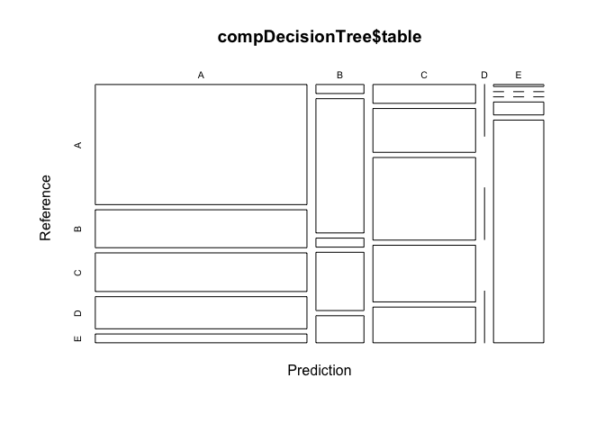
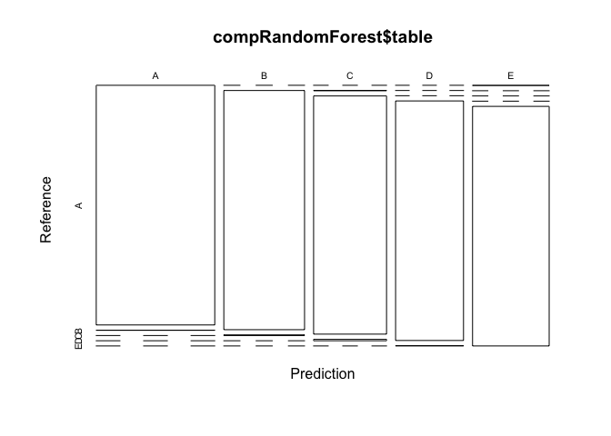
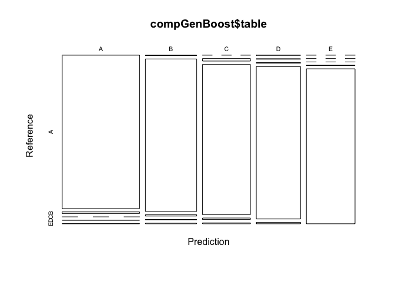

<hr>
#### Overview:
Using devices such as Jawbone Up, Nike FuelBand, and Fitbit it is now possible to collect a large amount of data about personal activity relatively inexpensively. These type of devices are part of the quantified self movement – a group of enthusiasts who take measurements about themselves regularly to improve their health, to find patterns in their behavior, or because they are tech geeks. One thing that people regularly do is quantify how much of a particular activity they do, but they rarely quantify how well they do it. In this project, your goal will be to use data from accelerometers on the belt, forearm, arm, and dumbell of 6 participants. They were asked to perform barbell lifts correctly and incorrectly in 5 different ways. 

#### Links For The Raw Data:

<p>
The data for this project are available here:
<ul>
  <li>
  Link to download traning data: [Training Data CSV]("https://d396qusza40orc.cloudfront.net/predmachlearn/pml-training.csv")
  </li>
  <li>
  Link to download test data: [Test Data CSV]("https://d396qusza40orc.cloudfront.net/predmachlearn/pml-testing.csv") 
  </li> 
  <li>
   Link to main source: [Main Source ]("http://groupware.les.inf.puc-rio.br/har") 
  </li>
</ul>
</p>


```r
# To reproduce the result please change the working directory
workingDirectory = "/Projects/Rworkspace/coursera/courseraMLWeek4"
setwd(workingDirectory)
```
#### Loading data & performing some basic exploratory data analysis:

```r
# Packages
library(caret)
```


```r
# checking if data directory exists if not creating it
if(!file.exists("./data")){
  dir.create("data")
  
  # Downloading the file 
  trainDataUrlPath <- "https://d396qusza40orc.cloudfront.net/predmachlearn/pml-training.csv"
  download.file(trainDataUrlPath, "./data/trainData.csv", method="curl")
  
  # Downloading the file 
  testDataUrlPath <- "https://d396qusza40orc.cloudfront.net/predmachlearn/pml-testing.csv"
  download.file(testDataUrlPath, "./data/testData.csv", method="curl")
}
```

Taking the overview of the training data before processing.
</i></p>

```r
# Loading the dataset
trainDataset <- read.csv("./data/trainData.csv", header = TRUE, sep = ",", quote = "\"", na.strings=c("NA","#DIV/0!",""))
validationDataset <- read.csv("./data/testData.csv", header = TRUE, sep = ",", quote = "\"", na.strings=c("NA","#DIV/0!",""))

# Cleaning the data
# removing near zero values
nearZeroVar <- nearZeroVar(trainDataset)
trainDataset <- trainDataset[, -nearZeroVar]

# removing na's 
nalVal <- sapply(trainDataset, function(x) mean(is.na(x))) > 0.95
trainDataset <- trainDataset[, nalVal==FALSE]

# removing the column 1:5
trainDataset <- trainDataset[, -c(1:5)]

# Partitioning the data
inTrain  <- createDataPartition(trainDataset$classe, p=0.7, list=FALSE)
trainingDataset <- trainDataset[inTrain,]
testingDataset <- trainDataset[-inTrain,]

# Checking the dimmension of the training data
dim(trainingDataset)
```

```
## [1] 13737    54
```

```r
# Checking the dimmension of the validation data
dim(testingDataset)
```

```
## [1] 5885   54
```
#### Model Building
####Using Decision Tree - Classification Model:

```r
# setting seed
set.seed(987)

# Fitting model using caret package - (method = rpart, i.e: decision tree)
modelFitDecionTree <- train(classe ~ ., data=trainingDataset, method="rpart")
modelFitDecionTree
```

```
## CART 
## 
## 13737 samples
##    53 predictor
##     5 classes: 'A', 'B', 'C', 'D', 'E' 
## 
## No pre-processing
## Resampling: Bootstrapped (25 reps) 
## Summary of sample sizes: 13737, 13737, 13737, 13737, 13737, 13737, ... 
## Resampling results across tuning parameters:
## 
##   cp          Accuracy   Kappa     
##   0.03880582  0.5546425  0.42955823
##   0.05538602  0.4099944  0.19504182
##   0.11351846  0.3214589  0.05315859
## 
## Accuracy was used to select the optimal model using the largest value.
## The final value used for the model was cp = 0.03880582.
```

```r
# Predicting on the test set
modelPredictDecionTree <- predict(modelFitDecionTree, newdata=testingDataset)
compDecisionTree <- confusionMatrix(modelPredictDecionTree, testingDataset$classe)
compDecisionTree
```

```
## Confusion Matrix and Statistics
## 
##           Reference
## Prediction    A    B    C    D    E
##          A 1526  482  491  408  112
##          B   26  387   26  168   78
##          C  116  270  509  349  220
##          D    0    0    0    0    0
##          E    6    0    0   39  672
## 
## Overall Statistics
##                                           
##                Accuracy : 0.5257          
##                  95% CI : (0.5129, 0.5386)
##     No Information Rate : 0.2845          
##     P-Value [Acc > NIR] : < 2.2e-16       
##                                           
##                   Kappa : 0.3807          
##  Mcnemar's Test P-Value : < 2.2e-16       
## 
## Statistics by Class:
## 
##                      Class: A Class: B Class: C Class: D Class: E
## Sensitivity            0.9116  0.33977  0.49610   0.0000   0.6211
## Specificity            0.6455  0.93721  0.80346   1.0000   0.9906
## Pos Pred Value         0.5055  0.56496  0.34768      NaN   0.9372
## Neg Pred Value         0.9484  0.85538  0.88306   0.8362   0.9207
## Prevalence             0.2845  0.19354  0.17434   0.1638   0.1839
## Detection Rate         0.2593  0.06576  0.08649   0.0000   0.1142
## Detection Prevalence   0.5130  0.11640  0.24877   0.0000   0.1218
## Balanced Accuracy      0.7785  0.63849  0.64978   0.5000   0.8059
```
<i>The following are the results obtained by Decision Tree model</i>
<ul>
  <li>Decision Tree Accuracy: 0.5257434 </li>
  <li>The out-of-sample error: 0.4742566</li>
</ul>


```r
# graphical overview
plot(compDecisionTree$table, col = compDecisionTree$byClass)
```

<!-- -->

<hr>
#### Using Random Forest:

```r
# setting seed
set.seed(657)

# defining cross validation parameter for the model
crossValidationParamRF <- trainControl(
    method="cv",
    number=5,
    savePredictions = TRUE,
    classProbs = TRUE,
    verboseIter=FALSE
    )

# Fitting model using caret package - (method = rf, i.e: random forest)
modelFitRandomForest <- train(classe ~ ., data=trainingDataset, method="rf",
                          trControl=crossValidationParamRF)
modelFitRandomForest
```

```
## Random Forest 
## 
## 13737 samples
##    53 predictor
##     5 classes: 'A', 'B', 'C', 'D', 'E' 
## 
## No pre-processing
## Resampling: Cross-Validated (5 fold) 
## Summary of sample sizes: 10990, 10990, 10990, 10988, 10990 
## Resampling results across tuning parameters:
## 
##   mtry  Accuracy   Kappa    
##    2    0.9938852  0.9922644
##   27    0.9965055  0.9955798
##   53    0.9936665  0.9919882
## 
## Accuracy was used to select the optimal model using the largest value.
## The final value used for the model was mtry = 27.
```

```r
# Predicting on the test set
modelPredictRandomForest <- predict(modelFitRandomForest, newdata=testingDataset)

compRandomForest <- confusionMatrix(modelPredictRandomForest, testingDataset$classe)
compRandomForest
```

```
## Confusion Matrix and Statistics
## 
##           Reference
## Prediction    A    B    C    D    E
##          A 1673    1    0    0    0
##          B    0 1137    3    0    0
##          C    0    1 1023    6    0
##          D    0    0    0  958    1
##          E    1    0    0    0 1081
## 
## Overall Statistics
##                                           
##                Accuracy : 0.9978          
##                  95% CI : (0.9962, 0.9988)
##     No Information Rate : 0.2845          
##     P-Value [Acc > NIR] : < 2.2e-16       
##                                           
##                   Kappa : 0.9972          
##  Mcnemar's Test P-Value : NA              
## 
## Statistics by Class:
## 
##                      Class: A Class: B Class: C Class: D Class: E
## Sensitivity            0.9994   0.9982   0.9971   0.9938   0.9991
## Specificity            0.9998   0.9994   0.9986   0.9998   0.9998
## Pos Pred Value         0.9994   0.9974   0.9932   0.9990   0.9991
## Neg Pred Value         0.9998   0.9996   0.9994   0.9988   0.9998
## Prevalence             0.2845   0.1935   0.1743   0.1638   0.1839
## Detection Rate         0.2843   0.1932   0.1738   0.1628   0.1837
## Detection Prevalence   0.2845   0.1937   0.1750   0.1630   0.1839
## Balanced Accuracy      0.9996   0.9988   0.9978   0.9968   0.9994
```
<i>The following are the results obtained by Random Forest</i>
<ul>
  <li>Random Forest Accuracy: 0.997791 </li>
  <li>The out-of-sample error: 0.002209</li>
</ul>


```r
# graphical overview
plot(compRandomForest$table, col = compRandomForest$byClass)
```

<!-- -->

<hr>
#### Using Generalized Boosted Model:

```r
# setting seed
set.seed(345)

# defining cross validation parameter for the Generalized Boosted Regression Model
crossValidationParamGB <- trainControl(
    method="repeatedcv",
    number=5,
    repeats = 1,
    savePredictions = TRUE,
    classProbs = TRUE
    )
# Fitting model using caret package - (method = gbm, i.e: generalized boosted regression)
modelFitGenBoost <- train(classe ~ ., data=trainingDataset, method="gbm",
                          trControl=crossValidationParamGB)


# because it has huge output, i have commented it
# modelFitGenBoost
```


```r
# Predicting on the test set
modelPredictGenBoost <- predict(modelFitGenBoost, newdata=testingDataset)

compGenBoost <- confusionMatrix(modelPredictGenBoost, testingDataset$classe)
compGenBoost
```
<i>The following are the results obtained by Generalized boosted model</i>
<ul>
  <li>Generalized boosted model Accuracy: 0.9848768 </li>
  <li>The out-of-sample error: 0.0151232</li>
</ul>


```r
# graphical overview
plot(compGenBoost$table, col = compGenBoost$byClass)
```

<!-- -->

<hr>
#### Model Selection/Conclusion:
So based on the accuracy, the results of random forest model are more accurate than the other models. so applying the results to the validation dataset.


```r
# Predicting on the validation Dataset
finalPrediction <- predict(modelFitRandomForest, newdata=validationDataset)
finalPrediction
```

```
##  [1] B A B A A E D B A A B C B A E E A B B B
## Levels: A B C D E
```


